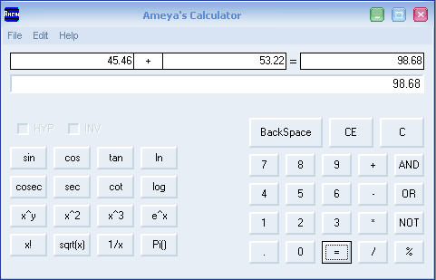



## New featured Scientific Calculator for genral purpose

### Description

its a general purpose calculator which provides operations of simple, trigonometric, logarithmic etc. calculations. It shows both the operands, operator and the answer in one shot eg. 3.8 * 2.0 = 7.6
 
### More Info
 

             |
---                |---
**Submitted On**   |2004-07-17 08:14:40
**By**             |[Ameya Khasgiwala](https://github.com/Planet-Source-Code/PSCIndex/blob/master/ByAuthor/ameya-khasgiwala.md)
**Level**          |Advanced
**User Rating**    |4.3 (13 globes from 3 users)
**Compatibility**  |VB 6\.0
**Category**       |[Complete Applications](https://github.com/Planet-Source-Code/PSCIndex/blob/master/ByCategory/complete-applications__1-27.md)
**World**          |[Visual Basic](https://github.com/Planet-Source-Code/PSCIndex/blob/master/ByWorld/visual-basic.md)
**Archive File**   |[New\_featur188460542005\.zip](https://github.com/Planet-Source-Code/ameya-khasgiwala-new-featured-scientific-calculator-for-genral-purpose__1-60369/archive/master.zip)

